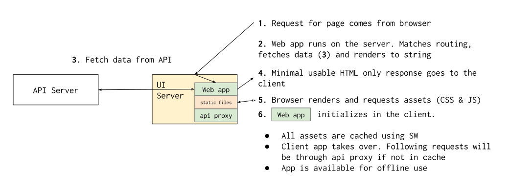

# Architecture

In this page we intend to explain the general architecture of the project so
that we can understand how the pieces fit together.

Main objectives of the architecture are:

* Keep API aggregation and transformations in a standalone server that we can
  scale and deploy somewhere else
* Same for the UI server, keep it standalone and focused so that it can be
  scaled as needed
* Support HTML only experience. Wikipedia is a content site and as such content
  should be available and usable even if other assets, like JavaScript, don't
  load or aren't supported
* Enhance the client experience on slow and unreliable networks and enable
  off-line access to the content

## Components

Current architecture is composed of two pieces to accomplish the first two
bullets on the previous list.

* **API server**: In charge of aggregation and transformation/massaging of
  content ([loot](https://github.com/joakin/loot))
* **UI server**: In charge of running the web app and server rendering,
  exposing the API through a proxy and serving the static assets
  ([loot-ui](https://github.com/joakin/loot-ui))
  * Any of this functionalities in a production environment can and should be
    moved to other tech stacks, like using nginx for static file serving and
    proxying, for example

Now that we understand the components, let's move in to understanding how they
interact in different scenarios and what goes on at a high level.

## First visit to a page

A user in a browser visits for the first time a page served by this
architecture.

If the browser client is capable enough, we'll serve the JavaScript assets that
will allow it to become a web app, so that navigation and caching happen in the
client and you don't have to reload the full page every time you click a link.

If the browser is service-worker capable, we set the service worker that
will intercept network requests and cache them, caching all the assets in the
application (html chrome, CSS assets and JS app assets), meaning next time you
visit the URL, the application will be there instantly and won't go to the
server normally, but using an ajax request for asking the API proxy for the
data needed (if it is not in the client cache).

This will mean that from that point on you'll be able to open the site without
internet connection and it will work.

